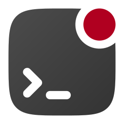

# unplugin-notifier

当打包器构建发生错误时发送原生通知，由 [unplugin](https://github.com/KeJunMao/unplugin-compression) 和 [node-notifier](https://github.com/mikaelbr/node-notifier/) 强力驱动

[![npm version][npm-version-src]][npm-version-href]
[![npm downloads][npm-downloads-src]][npm-downloads-href]
[![bundle][bundle-src]][bundle-href]
[![License][license-src]][license-href]
[![JSDocs][jsdocs-src]][jsdocs-href]

[English](./README.md) | 简体中文

## 预览

<details>
<summary>Windows</summary><br>


<br></details>

<details>
<summary>MacOS</summary><br>


<br></details>

<details>
<summary>Linux</summary><br>


<br></details>

## 安装

```bash
npm i unplugin-notifier
```

查看 `node-notifier` 的要求的[依赖](https://github.com/mikaelbr/node-notifier#requirements) ，以确定是否需要为系统安装额外的库。

<details>
<summary>Vite</summary><br>

```ts
// vite.config.ts
import Notifier from 'unplugin-notifier/vite'

export default defineConfig({
  plugins: [
    Notifier({ /* options */ }),
  ],
})
```

Example: [`playground/`](./playground/)

<br></details>

<details>
<summary>Rollup</summary><br>

```ts
// rollup.config.js
import Notifier from 'unplugin-notifier/rollup'

export default {
  plugins: [
    Notifier({ /* options */ }),
  ],
}
```

<br></details>


<details>
<summary>Webpack</summary><br>

```ts
// webpack.config.js
module.exports = {
  /* ... */
  plugins: [
    require('unplugin-notifier/webpack')({ /* options */ })
  ]
}
```

<br></details>

<details>
<summary>Nuxt</summary><br>

```ts
// nuxt.config.js
export default defineNuxtConfig({
  modules: [
    ['unplugin-notifier/nuxt', { /* options */ }],
  ],
})
```

> This module works for both Nuxt 2 and [Nuxt Vite](https://github.com/nuxt/vite)

<br></details>

<details>
<summary>Vue CLI</summary><br>

```ts
// vue.config.js
module.exports = {
  configureWebpack: {
    plugins: [
      require('unplugin-notifier/webpack')({ /* options */ }),
    ],
  },
}
```

<br></details>

<details>
<summary>esbuild</summary><br>

```ts
// esbuild.config.js
import { build } from 'esbuild'
import Notifier from 'unplugin-notifier/esbuild'

build({
  plugins: [Notifier()],
})
```

<br></details>

<details>
<summary>Rspack (⚠️ 实验性)</summary><br>

```ts
// rspack.config.js
module.exports = {
  plugins: [
    require('unplugin-notifier/rspack')({ /* options */ }),
  ],
}
```

<br></details>

[npm-version-src]: https://img.shields.io/npm/v/unplugin-notifier?style=flat&colorA=18181B&colorB=F0DB4F
[npm-version-href]: https://npmjs.com/package/unplugin-notifier
[npm-downloads-src]: https://img.shields.io/npm/dm/unplugin-notifier?style=flat&colorA=18181B&colorB=F0DB4F
[npm-downloads-href]: https://npmjs.com/package/unplugin-notifier
[bundle-src]: https://img.shields.io/bundlephobia/minzip/unplugin-notifier?style=flat&colorA=18181B&colorB=F0DB4F
[bundle-href]: https://bundlephobia.com/result?p=unplugin-notifier
[license-src]: https://img.shields.io/github/license/kejunmao/unplugin-notifier.svg?style=flat&colorA=18181B&colorB=F0DB4F
[license-href]: https://github.com/kejunmao/unplugin-notifier/blob/main/LICENSE
[jsdocs-src]: https://img.shields.io/badge/jsDocs.io-reference-18181B?style=flat&colorA=18181B&colorB=F0DB4F
[jsdocs-href]: https://www.jsdocs.io/package/unplugin-notifier
